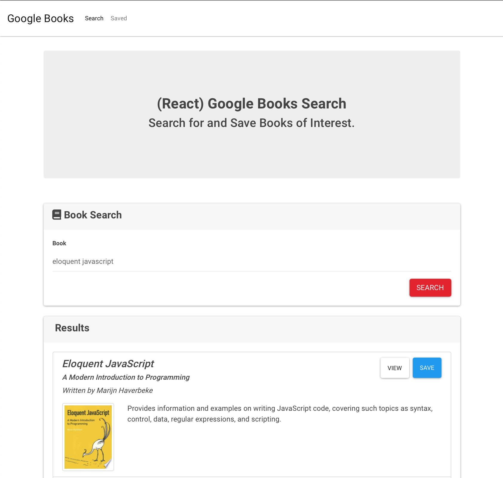
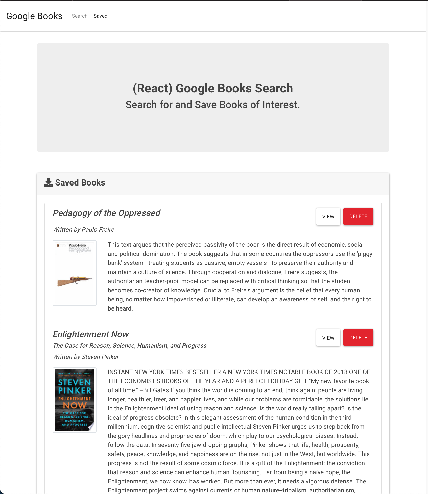

# Google Books Search

## Deployed Application link:
This app is deployed on the following heroku server: [Google Books Search](https://mysterious-journey-20132.herokuapp.com/saved)

## Description

This is a React-based Google Books Search app. This application was created using React components, helper/util functions, and  React lifecycle methods to query and display books based on user searches. The application uses Node, Express and MongoDB so that users can save books to review or purchase later.

## Installation
To install the necessary dependencies, run the following command: <code>npm install</code>

## Demo

